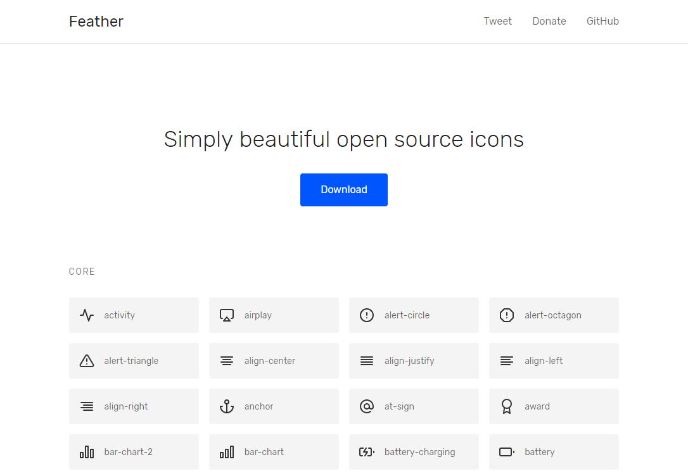

# What is this?

This is an Axure widget library based on [Feather](https://feathericons.com), simply beautiful open source icons.

# Demo

# Release Notes

2017-07-04

-   Sync with Feather 2.4.0

# How to use it?

1. You should install Axure 8.
2. Download the Axure library file: [Feather Icons v2.4.0](https://github.com/duzyn/feather-axure-library/blob/master/Feather%20Icons%20v2.4.0.rplib?raw=true)
3. Open Axure, click the three bars icon and choose "Load Library". Find the library file to Load it.
4. That's all! You can now enjoy your time for using beautiful icons in your prototypes.

# Author

I'm David Peng, a product manager in Shenzhen, China. You can find me on [@davidduzyn](http://twitter.com/davidduzyn) or [my blog](http://www.pengdaiwu.com).

